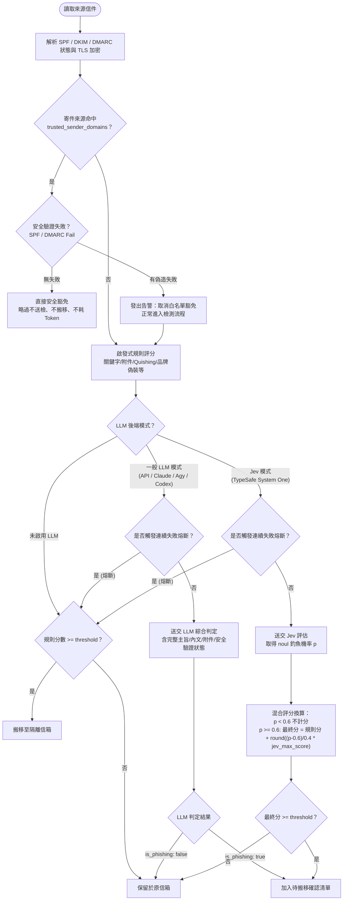

# AntiPhishing 釣魚郵件判定機制與防護體系說明書

本文件詳細說明 AntiPhishing（含 CLI 命令列版與 GUI 桌面版）目前所採用的完整郵件判定流程、規則演算法、安全驗證感知機制與 LLM / Jev 智慧分析架構。

---

## 目錄

1. [判定體系總覽與流程圖](#1-判定體系總覽與流程圖)
2. [第一道防線：白名單安全豁免與防偽冒保護](#2-第一道防線白名單安全豁免與防偽冒保護)
3. [第二道防線：郵件安全驗證（Authentication-Results）與傳輸加密解析](#3-第二道防線郵件安全驗證authentication-results與傳輸加密解析)
4. [第三道防線：啟發式規則評分機制（Heuristic Rules）](#4-第三道防線啟發式規則評分機制heuristic-rules)
5. [第四道防線：LLM 智慧判定與 TypeSafe Jev 混合評分](#5-第四道防線llm-智慧判定與-typesafe-jev-混合評分)
   - [5.1 一般 LLM 判定模式（API / CLI）](#51-一般-llm-判定模式api--cli)
   - [5.2 TypeSafe Jev (System One) 混合評分制](#52-typesafe-jev-system-one-混合評分制)
   - [5.3 資安通報與隔離明細排除標準](#53-資安通報與隔離明細排除標準)
6. [容錯、熔斷與安全防護機制](#6-容錯熔斷與安全防護機制)
7. [決策與搬移確認](#7-決策與搬移確認)

---

## 1. 判定體系總覽與流程圖

AntiPhishing 採用多層防禦（Defense-in-Depth）架構，結合基礎規則過濾與新一代大型語言模型：



---

## 2. 第一道防線：白名單安全豁免與防偽冒保護

為了解決內部通知、資安通報（如 Hinet SOC 病毒通知）、垃圾信隔離清單等高頻服務信件被誤判的問題，系統提供嚴密的白名單機制：

### 2.1 運作邏輯
- **設定欄位**：`config.toml` 中 `[detection].trusted_sender_domains`（例如 `["company.com.tw", "soc.hinet.net"]`）。
- **完全豁免條件**：
  1. 寄件者位址（From）包含白名單清單中之任一網域（不分大小寫）。
  2. 郵件最外層安全驗證**未發生** SPF 或 DMARC 偽造失敗（`warnings.is_empty()`）。
  3. **成果**：直接略過，不扣分、不呼叫任何外部 LLM 或 Jev API，不搬移，節省掃描時間與 API 成本。

### 2.2 防偽冒保護（Anti-Spoofing）
- 若攻擊者偽造白名單網域寄發詐騙信，邊界 MTA 會在標頭標註 `dmarc=fail` 或 `spf=fail`。
- 一旦偵測到偽造：
  - **自動取消白名單豁免**。
  - 記錄警告訊息：`注意：〈主旨〉寄件來源雖符合信任清單 (網域)，但安全驗證失敗（...），取消白名單豁免並送檢`。
  - 該信件進入常規檢測流程，且因為安全驗證失敗會被額外標記與加分。

---

## 3. 第二道防線：郵件安全驗證（Authentication-Results）與傳輸加密解析

系統會在解析信件結構時提取底層傳輸安全數據，並將其封裝為結構化狀態（`EmailAuthStatus`）：

### 3.1 邊界過濾規範（MTA Boundary Filtering）
只信任最外層收件伺服器的檢查結果，排除內部郵件轉發（Forwarding / Mailing List）的舊殘留：
- `Authentication-Results` 與 `ARC-Authentication-Results`：
  - 只信任最外層受信邊界（`i=1` 或未標註 `i=` 的現代 MTA 邊界標頭）。
  - `i > 1` 的 inner hop 結果一律忽略。
- `Received-SPF`：直接提取邊界 hop-local 結果。
- `spf=softfail`：不直接視為偽造（轉發或授權代發服務常見情境）。

### 3.2 解析內容與狀態傳遞
- **DMARC 狀態**：`pass` / `fail` / `none`。
- **DKIM 狀態**：`pass` / `fail` / `none`。
- **SPF 狀態**：`pass` / `fail` / `softfail` / `neutral` / `none`。
- **傳輸加密（TLS）**：從 `Received` 標頭解析是否使用加密傳輸（`TLSv1.3`、`TLSv1.2`、`ESMTPS`）。

組裝格式範例：
```text
安全驗證狀態：SPF: pass；DKIM: pass；DMARC: pass；TLS 傳輸加密: TLSv1.3
安全驗證警示：DMARC 驗證失敗（寄件者網域遭偽造）
```
此資訊會完整帶入 LLM 與 Jev Prompt，使 AI 具有完整的傳輸層信譽視野，而非僅憑文字內文猜測。

---

## 4. 第三道防線：啟發式規則評分機制（Heuristic Rules）

每個檢測項目依其風險程度賦予權重分數（基準門檻 `threshold = 8`）：

| 檢測維度 | 規則說明 | 評分調整 | 備註 |
| :--- | :--- | :---: | :--- |
| **可疑寄件網域** | 寄件者符合 `suspicious_sender_domains` | **+4** | 顯著黑名單網域 |
| **可疑關鍵字** | 內文命中 `suspicious_keywords`（如 verify, password, 密碼, 關稅） | **+1 / 個** | 上限 +3 分 |
| **多重連結** | 內文包含 2 個以上不同 URL | **+2** | 增加釣魚跳轉風險 |
| **混淆連結** | URL 中含有 `@` 符號（常用於遮蔽真實主機名稱） | **+3** | 高度可疑特徵 |
| **Quishing 攻擊** | HTML 內嵌 QR Code 圖片且含手機掃描相關文字 | **+4** | 跨裝置二維碼釣魚 |
| **品牌偽裝冒名** | 寄件者顯示名稱宣稱知名企業（DHL、FedEx、UPS、Momo、PChome、Shopee 等），但發信網域非官方白名單 | **+3** | 冒名促銷/詐欺 |
| **Word 外部圖片追蹤** | 離線解析 `.docx` 附件 relationship XML，發現外部 HTTP(S) 圖片 Web Bug | **+6** | 預設加 6 分（可自訂） |
| **信任寄件來源** | 命中 `trusted_sender_domains`（若未被直接安全豁免） | **-3** | 最低降至 0 分 |

---

## 5. 第四道防線：LLM 智慧判定與 TypeSafe Jev 混合評分

啟發式評分主要作為基礎輔助，而最終是否隔離則由 LLM / Jev 作為智慧中樞。

### 5.1 一般 LLM 判定模式（API / CLI）
支援以下後端：
- `api`：地端或雲端 OpenAI 相容介面（Ollama、LM Studio、vLLM 等）。
- `claude`：Anthropic Claude Code CLI。
- `codex`：OpenAI Codex CLI。
- `agy`：Google DeepMind Antigravity CLI。
- `command`：自訂命令列串接。

**判定原則**：
由 System Prompt 指定嚴格標準，僅輸出 JSON `{"is_phishing": bool, "reason": string}`。只有 `is_phishing == true` 者才列入待搬移清單。

### 5.2 TypeSafe Jev (System One) 混合評分制
在 `backend = "jev"` 模式下，AntiPhishing 不採取「100% 聽從單一模型」的二分法，而是採用**混合評分制度（Composite Scoring）**：

1. **Jev 機率判定**：
   - 透過 TypeSafe Jev 的 `noul` primitive，詢問 `is_phishing` 機率 \( p \in [0.0, 1.0] \)。
2. **換算分數公式**：
   - 當 \( p < 0.6 \)（未滿 60%）：不計分，\(\text{Jev 分數} = 0\)。
   - 當 \( p \ge 0.6 \)：將 \( 0.6 \sim 1.0 \) 線性映射至 \( 0 \sim \text{jev\_max\_score} \)（預設 `jev_max_score = 10`）：
   $$\text{ratio} = \min\left(1.0, \frac{p - 0.6}{0.4}\right)$$
   $$\text{Jev 分數} = \text{round}(\text{ratio} \times \text{jev\_max\_score})$$
3. **加總判定**：
   $$\text{最終分數} = \text{基礎啟發式規則分數} + \text{Jev 分數}$$
   - 當 $\text{最終分數} \ge \text{threshold}$ 時，才判定為釣魚/垃圾信並進行隔離。
   - 範例：若信件內含可疑關鍵字（2分），Jev 評估釣魚機率 84%（ratio = 0.6，換算得 6分），最終得分 $2 + 6 = 8 \ge 8$（達標隔離）；若釣魚機率僅 55%（未達 60% 不計分），最終得分 $2 + 0 = 2 < 8$（略過）。

### 5.3 資安通報與隔離明細排除標準
在 System Prompt 與 Jev criteria 中明確注入了排除條件（Signal 5）：
> 若郵件主旨或內文為企業資安通報、垃圾信隔離明細、防毒/SOC分析回報（如 Hinet SOC、防垃圾信通知等），且其安全驗證（SPF/DKIM/DMARC）通過或無偽造警示，即使內文引用被攔截之惡意網址或樣本，亦屬於正常資安服務通知，**不得判定為釣魚郵件（is_phishing 必須為 false）**。

---

## 6. 容錯、熔斷與安全防護機制

1. **連續失敗熔斷（Circuit Breaker）**：
   - 若 LLM / Jev 服務發生異常（網路中斷、Token 耗盡、逾時），單封信件失敗會自動退回規則評分判定（不中斷整個掃描批次）。
   - 若**連續失敗達 3 次**，系統自動觸發熔斷，該日期後續信件不再呼叫 LLM，直接以規則評分判定，保護系統穩定運作。
2. **未讀狀態精準還原（Unread State Restoration）**：
   - 讀取郵件內容時若造成郵件標記為已讀，在判定略過該郵件時，系統會自動發出 IMAP 指令清除 `\Seen` 旗標，精確還原使用者信箱的未讀狀態。
3. **安全離線 DOCX 檢驗**：
   - 僅透過標準 ZIP 壓縮函式庫讀取 `word/_rels/document.xml.rels`，純粹字串比對外部 Target URL。
   - 絕不呼叫外部 Microsoft Office 軟體、絕不連網下載外部圖片或引爆惡意程式。
4. **信箱架構重驗（UIDVALIDITY Check）**：
   - 搬移操作執行前，嚴格比對信箱 `UIDVALIDITY`，防止在掃描與搬移間隙信箱重建而發生誤搬。

---

## 7. 決策與搬移確認

AntiPhishing 堅持「不擅自誤刪使用者正常信件」的安全原則：

- **CLI 命令列版**：
  - 掃描結束後，於終端機印出所有判定為釣魚/垃圾廣告的清單、評分與具體理由。
  - 提供互動式選項：
    - `[a]` 全部搬移（Move All）
    - `[s]` 全部跳過（Skip All）
    - `[c]` 逐封決定（Confirm Each）
  - 若在 CI/CD 或定時排程執行，可透過 `-y` / `--yes` 參數跳過互動確認。
- **GUI 桌面版**：
  - 掃描發現威脅時，彈出待搬移清單確認對話框。
  - 清楚展示郵件 UID、主旨、寄件者、得分與判定理由。
  - 使用者點擊「確認搬移」後才執行移動與 Expunge，點擊「全部略過」則取消本輪搬移。
