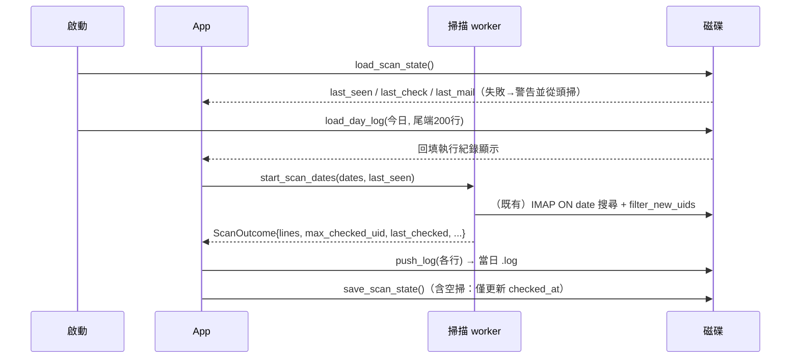

# 藍圖：GUI 每日日誌檔與掃描進度持久化

狀態：LOCKED（使用者核准：回填今日日誌＝要；舊檔處理＝自動清理）
範圍：僅 `AntiPhishingGUI/`（CLI 版不在此次範圍）

## 1. 背景與問題

- 執行紀錄（`App.logs`）只存在記憶體，程式關閉即消失，事後無法追查。
- 掃描進度（`last_seen`＝UIDVALIDITY＋最大已檢查 UID）同樣只在記憶體：
  每次重啟都會把「前一日＋今日」的信件從頭再送一次 LLM 判定，浪費時間與 token。
- 長時間常駐跨日時，舊紀錄永遠累積在 UI 清單中。

## 2. 目標

1. **每日一個日誌檔**：所有執行紀錄同步附加寫入 `logs/YYYY-MM-DD.log`（執行檔所在目錄下）。
2. **掃描進度檔**：將最後檢查到的郵件資訊（UID、主旨、所屬搜尋日期、檢查時間）與斷點
   （UIDVALIDITY＋最大已檢查 UID）存成 `scan_state.toml`。
3. **啟動時載入**：讀取進度檔回復 `last_seen`／`last_check`／最後一封郵件資訊，
   使重啟後的第一輪掃描即跳過已檢查過的信件。
4. **UI 只保留最後一天**：執行紀錄清單僅顯示當日條目；跨日（午夜）後舊條目自動清除。

### 非目標

- 不做日誌輪替壓縮、不上傳、不引入 log 函式庫（KISS，維持 std 檔案 IO）。
- 不改變搬移確認、LLM 判定、評分等既有行為。
- CLI 版不同步（其行為為一次性程序，無此需求）。

## 3. 架構設計（皆在 `src/main.rs` 單檔內，遵循現有 KISS 慣例）

### 3.1 資料模型

```rust
/// 掃描進度狀態檔內容（TOML），存於執行檔所在目錄 scan_state.toml。
#[derive(Serialize, Deserialize, Clone, Debug, PartialEq)]
struct LastScanState {
    uidvalidity: u32,        // 來源信箱世代；不符時 filter_new_uids 自動放棄斷點
    max_checked_uid: u32,    // 斷點：本世代已完整判定的最大 UID（LLM 失敗者不計，下輪重試）
    last_mail_uid: u32,      // 最後判定郵件 UID（參考資訊）
    last_mail_subject: String,
    last_mail_date: NaiveDate,   // 該封所屬的搜尋日期
    checked_at: DateTime<Local>, // 本狀態寫入時間（＝最後完成檢查時間）
}
```

`ScanOutcome` 新增一個欄位：

```rust
/// 本輪最後完成判定的郵件（搜尋日期、UID、主旨）；空掃為 None
last_checked: Option<(NaiveDate, u32, String)>,
```

UI 端 `App` 新增欄位 `last_mail: Option<(u32, String, NaiveDate)>`（顯示用），
並將 `logs: Vec<String>` 改為 `Vec<LogEntry>`：

```rust
struct LogEntry { date: NaiveDate, line: String }
```

> 取捨（ACCEPTED TRADEOFF）：`last_seen`／`last_check`／`last_mail` 與 `LastScanState`
> 欄位有部分重複；為避免大改既有 `App` 狀態機，保存時由這些欄位組裝、載入時反向填充。

### 3.2 檔案配置

| 檔案 | 位置 | 格式 |
|---|---|---|
| 日誌 | `<exe 目錄>/logs/YYYY-MM-DD.log` | 每行 `[YYYY-MM-DD HH:MM:SS] 訊息`，UTF-8 |
| 進度 | `<exe 目錄>/scan_state.toml` | TOML（`toml::to_string_pretty`） |

- 與 `config.toml` 同樣以執行檔所在目錄為基準（`current_exe()` 慣例）。
- `.gitignore` 需新增 `scan_state.toml`／`**/scan_state.toml`（`*.log` 與 `logs/` 已涵蓋）。

### 3.3 新函式（宣告層級）

```rust
fn scan_state_path() -> PathBuf                       // exe 目錄 + scan_state.toml
fn load_scan_state() -> Result<Option<LastScanState>> // 檔案不存在＝Ok(None)；解析失敗＝Err
fn save_scan_state(state: &LastScanState) -> Result<()>
fn log_dir() -> PathBuf                               // exe 目錄 + logs
fn log_file_name(date: NaiveDate) -> String           // "2026-08-25.log"
fn append_log_lines(dir: &Path, date: NaiveDate, messages: &[String]) -> Result<()>
    // create_dir_all + OpenOptions append/create；逐行加 [YYYY-MM-DD HH:MM:SS] 前綴
fn load_day_log(dir: &Path, date: NaiveDate, max_lines: usize) -> Result<Vec<String>>
    // 讀取指定日檔案尾端最多 max_lines 行（供啟動時回填 UI 顯示）
fn prune_logs(entries: &mut Vec<LogEntry>, today: NaiveDate) // 移除非当日條目（純函式便於測試）
```

`App` 新增方法：

```rust
fn push_log(&mut self, message: String)
    // 統一日誌入口：加時間戳 → 寫入當日檔案（失敗僅在狀態列提示一次，不中斷）→ 入列 → prune_logs
```

### 3.4 流程



關鍵語意（延續現況，不改變）：

- `max_checked_uid` 只計「已完成判定」的信；LLM 判定失敗中止時，失敗那封不列入 → 重啟後會重試。
- 空掃（無新郵件）輪：不寫 UI 紀錄，但**寫一行審計紀錄到當日檔案**（`排程檢查：無新郵件。`），
  並更新進度檔的 `checked_at`（`last_mail_*` 沿用上一筆）。
- UIDVALIDITY 變更：載入的斷點自然失效（`filter_new_uids` 既有行為），全量重掃，安全方向。
- 寫檔失敗（磁碟、權限）：掃描與 UI 不受影響，僅狀態列顯示一次性警告。

### 3.5 UI 變更

- 「最後檢查時間」下方新增一行（有資料時）：
  `上次檢查至 UID <n>〈主旨〉（<日期>）`。
- 執行紀錄改走 `LogEntry`，繪製處 `.rev().take(20)` 邏輯不變；
  啟動時以今日檔案尾端回填，跨日後舊條目由 `prune_logs` 清除。

## 4. 測試策略（離線單元測試，沿用現有風格）

| 測試 | 驗證 |
|---|---|
| `scan_state_round_trips_through_toml` | 序列化→反序列化欄位完整保留 |
| `corrupt_or_missing_scan_state_yields_none` | 缺檔＝None；亂碼＝Err（呼叫端轉為警告） |
| `log_file_name_formats_daily_path` | `log_file_name(d) == "YYYY-MM-DD.log"` |
| `append_log_lines_creates_and_appends` | 建目錄、兩次呼叫為附加非覆蓋、含時間戳前綴 |
| `load_day_log_caps_and_scopes_to_date` | 只讀指定日檔案、回傳尾端上限行數 |
| `prune_logs_keeps_only_today` | 跨日條目被移除、當日保留 |

（檔案型測試使用 `std::env::temp_dir()`＋唯一子目錄，結束清理；不連網。）

## 5. 實作順序（每步通過 cargo check 後再下一步）

- [x] 1. `LastScanState`＋載入/保存函式＋單元測試
- [x] 2. `ScanOutcome.last_checked` 於 `scan_mail` 填充（含中止/空掃路徑）
- [x] 3. 日誌基建：`LogEntry`、`log_*` 函式、`App::push_log` 取代現有兩處直接 push（併入 `cleanup_old_logs` 啟動清理與今日回填）
- [x] 4. `poll()` Done 分支接上 `save_scan_state`（含空掃更新 `checked_at`）
- [x] 5. `App::new` 載入進度檔與今日日誌回填；UI 顯示「上次檢查至 …」
- [x] 6. `.gitignore` 增加 `scan_state.toml`
- [x] 7. 文件同步：README（新檔案說明）、CLAUDE.md／AGENTS.md 架構段補述
- [x] 8. 版號 0.3.0 → 0.4.0，`cargo check` 同步 lock（chrono 加 `serde` feature 供進度檔序列化）
- [x] 9. 全量驗證：`cargo check` + `cargo fmt --check` + `cargo test`

## 6. 風險與開放決策

| # | 項目 | 建議 | 等級 |
|---|---|---|---|
| R1 | 舊日誌檔永久累積 | **已決策：自動清理**——啟動時刪除超過保留天數的 `YYYY-MM-DD.log`；天數由 `[gui] log_retention_days` 設定（0.5.0 起開放設定，預設 30＝`LOG_RETENTION_DAYS`，0＝永不清理），檔名不可解析者一律跳過 | RESOLVED |
| R2 | 進度檔損毀 | 視同不存在，警告後全量重掃（安全側） | ACCEPTED |
| R3 | 啟動是否回填今日日誌到 UI | **已決策：回填**今日檔案尾端約 200 行（常數 `BACKFILL_LOG_LINES`） | RESOLVED |
| R4 | 多日期輪中「最後一封」以處理順序為準，可能非最大 UID | 屬參考資訊；斷點仍以 max UID 為準 | ACCEPTED |

### 鎖定補充（依決策新增）

```rust
const LOG_RETENTION_DAYS: i64 = 30;
const BACKFILL_LOG_LINES: usize = 200;

fn cleanup_old_logs(dir: &Path, today: NaiveDate, retention_days: i64) -> usize
    // 刪除 dir 下「檔名可解析為日期且早於 today - retention_days」的 .log；回傳刪除數
```

實作順序第 3 步步併入：啟動時（App::new）先 `cleanup_old_logs` 再 `load_day_log` 回填。
